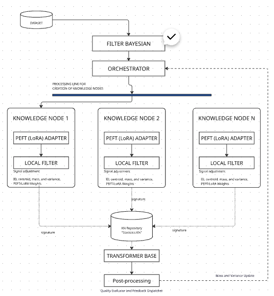

# Xctopus

<div align="center">


[](https://xctopus.com)
[](#-documentation)
[](https://doi.org/10.5281/zenodo.17862643)

</div>

Xctopus (Alpha) is an adaptive knowledge architecture designed to mitigate Catastrophic Forgetting through distributed epistemic memory. The system organizes information flows into hierarchical structures of Knowledge Nodes (KNs) that evolve dynamically according to the nature of the data.

The system is built from Transformers, Bayesian Nodes, and modular knowledge orchestration. It implements an **Adaptive Knowledge Architecture by Layers**, where Layer 1 acts as a "living organism" that automatically adjusts its granularity according to domain complexity.

**Empirically validated** on semantically opposite domains (conversational and scientific), Xctopus demonstrates automatic adaptation while maintaining semantic purity. Contributions are welcome as the system continues its active development.

### Technology Stack

<div align="left">


</div>

### Table of Contents

- [Project Objective](#project-objective)
- [Architecture Overview](#architecture-overview)
- [How it Works](#how-it-works)
- [Capa Clustering (Layer 1)](#capa-clustering-layer-1)
- [Empirical Validation (Layer 1)](#empirical-validation-layer-1)
- [Performance Optimizations](#performance-optimizations)
- [Project Structure](#project-structure)
- [Installation](#installation)
- [Quick Start](#quick-start)
- [Configuration](#configuration)
- [Documentation](#documentation)
- [Roadmap](#roadmap)
- [Contributions](#contributions)
- [License](#license)

---

## Project Objective

Our primary mission is the **Mitigation of Catastrophic Forgetting** in continual learning systems. Xctopus achieves this by evolving from a rigid model into an **Adaptive Knowledge Architecture**.

### Key Focus Areas

**Organic Adaptation**: Layer 1 acts as a "living organism" that adjusts its granularity based on domain complexity (e.g., automatically shifting from "Continents" in conversational data to "Archipelagos" in scientific data).

**Epistemic Collaboration**: Multiple Knowledge Nodes collaborate to process information, update Bayesian beliefs, and enable cumulative learning while preserving previously acquired knowledge.

**Traceability**: Ensuring that every piece of acquired knowledge is persistent, scalable, and semantically pure.

The system demonstrates **automatic adaptation** - detecting domain characteristics and adjusting clustering density without manual intervention, while maintaining semantic purity across diverse domains (validated on conversational and scientific domains with <1% variance difference).

### Project Status

⚠️ **Alpha / Experimental** — Xctopus is an evolving research prototype. Layer 1 (Clustering & Fusion) is currently operational and validated. Future layers are under active development. Use with caution in production environments. Contributions and feedback are welcome as the system continues to grow.

---

## Architecture Overview



Xctopus is built on an Adaptive Knowledge Architecture by Layers, where each layer acts as a specialized component that evolves based on domain characteristics. Currently, Layer 1 (Clustering & Fusion) is fully implemented, optimized, and empirically validated.

### Core Principles

1. **Adaptive Granularity**: Layer 1 acts as a "living organism" that automatically adjusts clustering density. It successfully transitions from "Continents" (broad topics) to "Archipelagos" (technical niches) without manual retuning.

2. **Hierarchical Nodes**: Knowledge Nodes encapsulate self-contained computational units with statistical signatures (Centroid, Mass, Variance).

3. **Modular Orchestration**: A lightweight layer that coordinates the FilterBayesian and KNRepository for real-time routing.

4. **Continuous Learning**: Bayesian belief updating for adaptive knowledge acquisition, mitigating catastrophic forgetting at the structural level.

5. **Optimized Performance**: 99% of iterations in GPU/RAM via vectorized operations and SQLite WAL mode.

6. **Semantic Purity Preservation**: Maintains strict knowledge coherence (variance stability ~0.29) even when scaling from 600 to 3,900+ nodes.

---

## How it Works (The 4 Golden Rules)

Xctopus does not use static clustering. Instead, it implements **Organic Knowledge Induction**. The system grows and reshapes itself following four fundamental rules:

### 1. **Bayesian Routing**
Every new piece of data is evaluated by the FilterBayesian. It calculates the probability of belonging to a node based on its gravitational pull (mass) and semantic distance.

### 2. **Semantic Purity**
A LocalFilter acts as a quality gate. If a data point is an outlier that would ruin a node's coherence (variance), it is rejected to keep the knowledge "pure."

### 3. **Knowledge Birth (Buffers)**
Data that doesn't fit anywhere isn't lost. It goes to a Temporary Buffer. When enough similar ideas gather, a new Knowledge Node is born.

### 4. **Evolutionary Stability**
Nodes update their "memory" (centroid and variance) using Welford's Algorithm. This allows the system to learn incrementally without ever needing to re-train from scratch.

**Visualization**: The system maps knowledge as a galaxy of nodes where size reflects accumulated semantic mass. See the "Visual Evidence" section below for detailed visualization of the "Archipelago" structure in scientific domains.

### Key Differentiators

- **Dynamic Growth**: Knowledge Nodes are created organically as new concepts emerge, not predefined
- **Real-time Statistics**: Centroids, mass, and variance are updated incrementally with each embedding
- **Bayesian Intelligence**: Routing decisions consider both similarity and node maturity (mass)
- **Memory Efficient**: No duplicate storage; Repository is the single source of truth
- **Persistent Learning**: System state is maintained across sessions via SQLite persistence
- **Adaptive Granularity**: Automatically adjusts clustering density based on domain characteristics (validated on conversational and scientific domains)
- **Post-Clustering Fusion**: Intelligent merging of similar nodes to reduce fragmentation while preserving semantic purity

---

## Capa Clustering (Layer 1)

**Capa Clustering** is the foundational layer of Xctopus, responsible for organic organization of embeddings into Knowledge Nodes through statistical routing and semantic coherence.

### Key Components

#### 1. **KNRepository** (`repository.py`)
- SQLite-based persistence for Knowledge Node metadata
- Efficient FP16 tensor storage as BLOBs
- Buffer management for temporary embeddings
- Optimized queries with WAL mode and vectorized operations

#### 2. **FilterBayesian** (`filter_bayesian.py`)
- Core routing logic based on 4 Golden Rules:
  - **Rule 1**: Similarity Threshold (`S_MIN`)
  - **Rule 2**: Critical Mass (`log1p(mass) * LAMBDA_FACTOR`)
  - **Rule 3**: Variance Penalty
  - **Rule 4**: Statistical Stability
- Vectorized similarity calculations for performance

#### 3. **KnowledgeNode** (`knowledgenode.py`)
- Encapsulates statistical signature (centroid, mass, variance)
- Welford's algorithm for numerically stable updates (FP16-safe)
- Local filter for semantic purity validation
- Transformer/LoRA components (standby for future layers)

#### 4. **Orchestrator** (`orchestrator.py`)
- Coordinates routing decisions and node lifecycle
- Intelligent refresh of FilterBayesian signatures (every `REFRESH_INTERVAL`)
- Buffer aggregation (groups similar buffers before creating new ones)
- Warmup: loads existing nodes from Repository on startup

#### 5. **Main** (`main.py`)
- Entry point for processing datasets
- Optimized processing loop (warmup + intelligent refresh)
- Rich console output with progress bars and formatted tables
- Batch commits for efficient database operations

#### 6. **Fusion Engine** (`fusion.py`)
- Post-clustering fusion protocol for consolidating similar Knowledge Nodes
- Vectorized similarity matrix calculations (optimized for large-scale analysis)
- Semantic adjacency matrix computation
- Automatic buffer reassignment after fusion operations
- Fusion potential diagnostics with optimized O(n²) → O(n²) vectorized operations

### Features

- ✅ **Optimized Performance**: 99% of iterations in GPU/RAM, minimal disk I/O
- ✅ **Numerical Stability**: Welford's algorithm prevents FP16 overflow
- ✅ **Memory Efficient**: No duplicate embedding storage (Repository is single source of truth)
- ✅ **Scalable**: Vectorized operations handle large datasets efficiently
- ✅ **Persistent**: SQLite WAL mode for concurrent read/write operations
- ✅ **Traceable**: Comprehensive logging and structured output
- ✅ **Adaptive Clustering**: Automatically adjusts granularity based on domain characteristics
- ✅ **Post-Clustering Fusion**: Intelligent merging of similar Knowledge Nodes to reduce fragmentation
- ✅ **Vectorized Diagnostics**: Optimized similarity calculations for large-scale analysis

---

## Project Structure

```
xctopus/
├── src/
│   └── xctopus/
│       ├── __init__.py              # Package initialization and exports
│       ├── settings.py              # Centralized configuration (NO hardcoded values)
│       ├── logger_config.py         # Logging setup
│       ├── main.py                  # Entry point for Capa Clustering
│       ├── repository.py            # KNRepository: SQLite persistence
│       ├── filter_bayesian.py       # FilterBayesian: Routing logic
│       ├── knowledgenode.py         # KnowledgeNode: Core node logic
│       ├── orchestrator.py          # Orchestrator: Coordination layer
│       └── fusion.py                # Fusion Engine: Post-clustering consolidation
├── notebooks/                       # Jupyter notebooks for testing and analysis
│   └── quickstart.ipynb             # Main testing notebook
├── logs/                            # Log files (auto-generated)
├── knowledge_base.sqlite            # SQLite database (auto-generated)
├── pyproject.toml                   # Dependencies and project config
├── .gitignore
└── README.md
```

---

## Installation

### Prerequisites

- Python 3.8+
- PyTorch (CPU or CUDA)
- SQLite3 (usually included with Python)

### Basic Installation

```bash
# Clone the repository
git clone https://github.com/msancheza/xctopus-core.git
cd xctopus-core/xctopus

# Install dependencies
pip install -e .
```

### Optional Dependencies

For enhanced functionality:

```bash
# Enhanced console output (formatted tables, progress bars)
pip install rich>=13.0.0

# Or install all optional dependencies
pip install -e ".[all]"
```

**Note**: The system works without `rich`, but with reduced console formatting.

---

## Quick Start

### 1. Prepare Your Dataset

Your dataset should be a CSV file with embeddings. Each row should contain a single embedding vector (384 dimensions by default, configurable in `settings.py`).

Example CSV format:
```csv
embedding_0,embedding_1,embedding_2,...,embedding_383
0.123,0.456,0.789,...,0.321
...
```

### 2. Run Capa Clustering

```bash
# Process your dataset
python -m xctopus.main data/embeddings.csv
```

The system will:
1. Load embeddings from the CSV
2. Initialize components (Repository, FilterBayesian, Orchestrator)
3. Process each embedding through the routing system
4. Create Knowledge Nodes organically based on semantic similarity
5. Execute post-clustering fusion to consolidate similar nodes
6. Display progress and summary statistics

### 3. Programmatic Usage

```python
from xctopus import KNRepository, FilterBayesian, Orchestrator
from xctopus.main import load_embeddings, process_dataset, initialize_components
import torch

# Initialize components
repository, filter_bayesian, orchestrator = initialize_components()

# Load embeddings from CSV
embeddings = load_embeddings("data/embeddings.csv")

# Process dataset
process_dataset(
    embeddings=embeddings,
    repository=repository,
    filter_bayesian=filter_bayesian,
    orchestrator=orchestrator
)

# Access results
signatures = repository.get_all_signatures()
print(f"Created {len(signatures)} Knowledge Nodes")

# Optional: Run fusion to consolidate similar nodes
from xctopus.fusion import fuse_knowledge_nodes, diagnose_fusion_potential

# Diagnose fusion potential
diagnosis = diagnose_fusion_potential(repository)
print(f"Fusion potential: {diagnosis['similarity_pairs']}")

# Execute fusion
fusion_stats = fuse_knowledge_nodes(repository, orchestrator)
print(f"Fusion completed: {fusion_stats['fusions_performed']} nodes merged")
```

---

## Configuration

All configuration is centralized in `src/xctopus/settings.py`. **No hardcoded values** are allowed in the codebase.

### Key Parameters

```python
# Technical Configuration
DTYPE = torch.float16          # Half-precision for memory efficiency
DEVICE = "cuda" or "cpu"      # Auto-detected based on availability

# Routing Parameters
S_MIN = 0.65                  # Minimum cosine similarity threshold (optimized for diverse datasets)
LAMBDA_FACTOR = 0.1           # Critical mass attraction strength

# Structure Parameters
EMBEDDING_DIM = 384           # Embedding vector dimension
BUFFER_THRESHOLD = 3          # Embeddings needed to promote buffer to KN (reduced for faster concept validation)

# Persistence Parameters
DB_PATH = "knowledge_base.sqlite"
SAVE_BATCH_SIZE = 10          # Batch commits for efficiency

# Orchestrator Parameters
REFRESH_INTERVAL = 10         # Intelligent refresh frequency

# Fusion Parameters
FUSION_SIMILARITY_THRESHOLD = 0.85  # Minimum similarity for node fusion
FUSION_MIN_MASS = 10                 # Maximum mass for "Small Stable" nodes
FUSION_MAX_VARIANCE = 0.5            # Maximum variance for stable nodes
FUSION_VARIANCE_INCREASE_THRESHOLD = 0.1  # Maximum variance increase after fusion
```

### Customizing Configuration

Edit `src/xctopus/settings.py` directly, or create a custom settings module:

```python
# custom_settings.py
import torch
from xctopus.settings import *

# Override specific parameters
S_MIN = 0.80
BUFFER_THRESHOLD = 10
REFRESH_INTERVAL = 20
```

---

## Roadmap

Xctopus follows a **layered architecture approach**, where each layer builds upon the previous one:

### ✅ Layer 1: Clustering & Fusion (COMPLETED - December 2025)

**Status**: Fully implemented, optimized, and empirically validated

- ✅ **Core Components**: Repository, FilterBayesian, KnowledgeNode, Orchestrator
- ✅ **Fusion Engine**: Post-clustering consolidation of similar Knowledge Nodes
- ✅ **Vectorized Diagnostics**: Optimized similarity calculations for large-scale analysis
- ✅ **Universal Validation**: System validated on conversational and scientific domains
- ✅ **Adaptive Granularity**: Automatic adjustment of clustering density based on domain
- ✅ **Performance Optimizations**: Vectorized operations, intelligent refresh, batch commits

**Validation Results**:
- Processes 18,260 embeddings in ~15-16 minutes
- Maintains semantic purity (variance ~0.29) across diverse domains
- Demonstrates automatic adaptation (5.7× granularity difference between domains)

### 🔄 Layer 2: Fine-tuning & Persistence (IN DEVELOPMENT)

**Focus**: Incremental training of Knowledge Nodes created in Layer 1

- [ ] Transformer/LoRA fine-tuning for each Knowledge Node
- [ ] Incremental learning protocols
- [ ] Knowledge persistence and retrieval
- [ ] Training state management

### 📅 Layer 3+: Hierarchical Orchestration

- [ ] Multi-layer orchestration
- [ ] Attention mechanisms between nodes
- [ ] Advanced morphological operations
- [ ] Cross-layer knowledge transfer

### Future Work

- [ ] Benchmark experiments on standard continual learning datasets
- [ ] Performance profiling and optimization
- [ ] Integration with external knowledge bases

---

## Performance Optimizations

The current implementation includes several critical optimizations:

1. **Warmup Initialization**: Load signatures once at startup, not per iteration
2. **Intelligent Refresh**: Update FilterBayesian signatures only when needed (`REFRESH_INTERVAL`)
3. **Vectorized Operations**: Single SQL JOIN for buffer centroids (instead of N queries)
4. **WAL Mode**: SQLite Write-Ahead Logging for concurrent read/write
5. **Batch Commits**: Periodic database commits for efficiency
6. **Memory Optimization**: No duplicate embedding storage (Repository is single source)
7. **Vectorized Similarity Calculations**: Matrix operations for fusion diagnostics (reduces O(n²×5) to single vectorized pass)
8. **Adaptive Granularity**: System automatically adjusts clustering density based on domain characteristics

**Result**: Processes 18,260 embeddings in ~15-16 minutes with full fusion operations (vs. several hours without optimizations).

---

## Empirical Validation (Layer 1)

### 📊 The Semantic Duality

Xctopus has demonstrated a unique capability to detect and adapt to the "semantic fingerprint" of different domains without manual intervention:

#### Conversational Domain ("Continents")
The knowledge clusters into large thematic masses with dominant master nodes:
- **Master Node Mass**: 93 embeddings (13.7× the average)
- **Architecture**: Few large hubs acting as semantic centers
- **Pattern**: Broad, general topics attract many related documents

#### Scientific Domain ("Archipelago")
The system generates a dense network of thousands of specialized islands:
- **Total Knowledge Nodes**: 3,901 (5.7× more granular)
- **Master Node Mass**: 28 embeddings (only 3.5× the average)
- **Architecture**: Uniform distribution, no dominant hubs
- **Pattern**: Each technical concept forms its own compact, well-defined cluster

### Performance Metrics

| Metric | Conversational Domain | Scientific Domain (arXiv) | Interpretation |
|:---|:---|:---|:---|
| **Node Consolidation** | 42.71% | 82.95% | Scientific domain shows extreme efficiency |
| **Noise Reduction** | Baseline | **-79%** | Better consolidation in structured domains |
| **Semantic Purity (Variance)** | 0.2909 | 0.2882 | **<1% difference** - purity preserved |
| **Knowledge Nodes** | 680 | 3,901 | Automatic granularity adjustment |
| **Max Node Mass** | 93 | 28 | Uniform distribution in scientific domain |

**Interpretation**: The stability of variance (difference < 1%) confirms that the system maintains knowledge purity regardless of whether the data is fluid conversational language or highly technical scientific content. The system automatically detects domain characteristics and adjusts its clustering density (5.7× more nodes in scientific domain) while preserving semantic coherence.

### Visual Evidence


The "Knowledge Galaxy" visualization provides visual proof of the "Archipelago" structure in scientific domains - a perfectly organized network of specialized knowledge islands with uniform distribution and absence of dominant hubs.

---

## Contributions

Contributions are welcome! We appreciate your interest in helping improve Xctopus.

- 📖 **Read our [Contributing Guide](CONTRIBUTING.md)** to get started
- 📋 **Review our [Code of Conduct](CODE_OF_CONDUCT.md)** to understand our community standards

Whether you're fixing bugs, adding features, improving documentation, or suggesting ideas, all contributions are valued and recognized.

---

## License

This project is licensed under the MIT License - see the [LICENSE.md](LICENSE.md) file for details.

---

## Links and Resources

- 🌐 **Official website**: [xctopus.com](https://xctopus.com)
- 📚 **Documentation**: See `docs/` folder for detailed guides
- 💬 **Research Discussion**: [Approaches to Mitigate Catastrophic Forgetting in Modular Systems](https://discuss.huggingface.co/t/approaches-to-mitigate-catastrophic-forgetting-in-modular-systems/170536)

---

## Final Note

This project is in an exploratory phase. The intention is to build an innovative architecture, inspired by adaptive and hierarchical systems, and open it to interested researchers when ready.

**Current Focus**: Capa Clustering (Layer 1) is complete and operational. Future layers will build upon this foundation.
