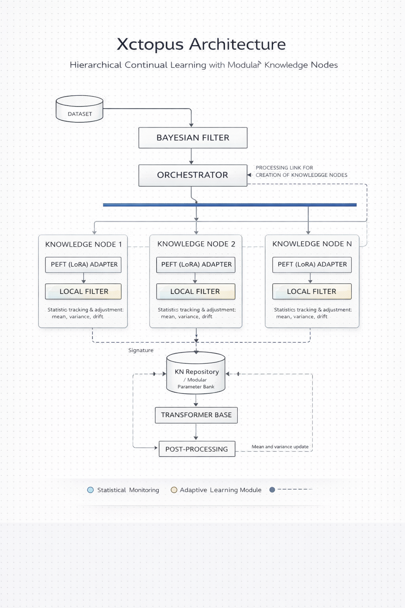
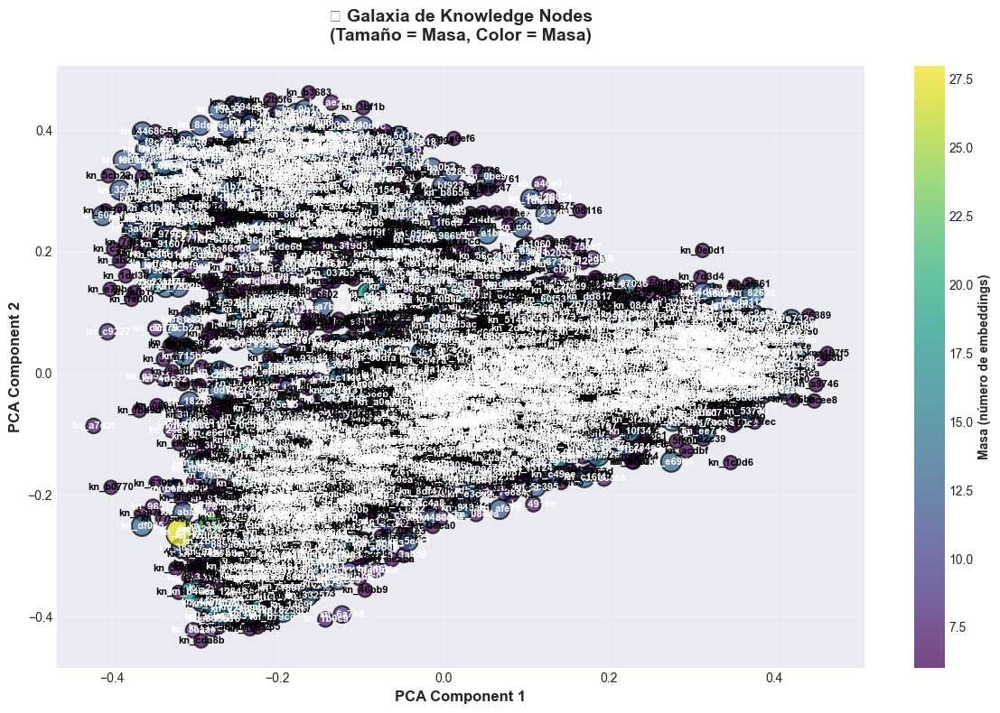

# Xctopus

<div align="center">


[](https://xctopus.com)
[](#-documentation)
[](https://doi.org/10.5281/zenodo.17862643)

</div>

Xctopus (Alpha): Autonomous Knowledge Induction & Dynamic LoRA Orchestration

The system is built from Transformers, Bayesian Nodes, and modular knowledge orchestration. It implements an **Adaptive Knowledge Architecture** that automatically adjusts its granularity according to domain complexity.

**Empirically validated** on semantically opposite domains (conversational and scientific), Xctopus demonstrates automatic adaptation while maintaining semantic purity. Contributions are welcome as the system continues its active development.

### Technology Stack

<div align="left">


</div>

### Table of Contents

- [Project Objective](#project-objective)
- [Architecture Overview](#architecture-overview)
- [How it Works](#how-it-works)
- [Key Components](#key-components)
- [Project Structure](#project-structure)
- [Installation](#installation)
- [Quick Start](#quick-start)
- [Configuration](#configuration)
- [Roadmap](#roadmap)
- [Performance Optimizations](#performance-optimizations)
- [Empirical Validation](#empirical-validation)
- [Contributions](#contributions)
- [License](#license)
- [Links and Resources](#links-and-resources)
- [Final Note](#final-note)

---

## Project Objective

Our mission is to solve **Catastrophic Forgetting** in continual learning environments. Xctopus achieves this by replacing rigid model structures with an **Adaptive Knowledge Architecture** that scales with data complexity.

### Key Focus Areas

**Organic Adaptation**: The system autonomously adjusts its granularity—shifting from broad categories to dense "archipelagos" of expertise as domain complexity increases.

**Epistemic Collaboration**: Knowledge Nodes (KNs) act as specialized agents that update Bayesian beliefs, enabling cumulative learning without degrading previously acquired weights.

**Data Traceability**: 100% provenance tracking; every specialized weight (LoRA) is linked back to its original source data for full auditability and semantic purity.

### Project Status

⚠️ **Alpha / Experimental** — The core engine is fully operational, featuring:

- **Reactive Orchestration**: Real-time routing and LoRA inference.
- **Automated Training**: Asynchronous PEFT triggers and non-blocking knowledge induction.
- **Stability**: Validated across diverse domains (Conversational & Scientific) with high semantic consistency (<1% variance).

Contributions are welcome as we scale from prototype to a production-ready framework.

---

## Architecture Overview



Xctopus is built on an Adaptive Knowledge Architecture, where specialized components evolve based on domain characteristics. The system includes clustering, fusion, reactive orchestration with LoRA inference, and continuous training infrastructure.

### Core Principles

1. **Adaptive Granularity**: The system acts as a "living organism" that automatically adjusts clustering density. It successfully transitions from "Continents" (broad topics) to "Archipelagos" (technical niches) without manual retuning.

2. **Hierarchical Nodes**: Knowledge Nodes encapsulate self-contained computational units with statistical signatures (Centroid, Mass, Variance).

3. **Modular Orchestration**: A lightweight layer that coordinates the FilterBayesian and KNRepository for real-time routing.

4. **Continuous Learning**: Bayesian belief updating for adaptive knowledge acquisition, mitigating catastrophic forgetting at the structural level.

5. **Optimized Performance**: 99% of iterations in GPU/RAM via vectorized operations and SQLite WAL mode.

6. **Semantic Purity Preservation**: Maintains strict knowledge coherence (variance stability ~0.29) even when scaling from 600 to 3,900+ nodes.

---

## How it Works

### The Xctopus Lifecycle: Route → Act → Judge → Learn

Xctopus doesn't use static clusters. It grows like a living ecosystem through a continuous feedback loop:

**Smart Routing**: The FilterBayesian evaluates every new piece of data. It doesn't just look at similarity; it considers the gravitational pull (mass) of existing nodes to decide where the data belongs.

**Semantic Purity**: A LocalFilter acts as a gatekeeper. If a data point is an outlier that would dilute a node's focus, it is rejected to keep the specialized knowledge "pure."

**Auto-Expansion (Buffers)**: Unmatched data isn't discarded. It gathers in a temporary buffer. When a critical mass of similar ideas is reached, a new Knowledge Node is born automatically.

**Specialization (LoRA)**: Once a node is mature, Xctopus triggers an asynchronous training task. The node gets its own LoRA adapter, transforming it from a data cluster into a specialized expert.

**Reinforcement Learning**:
- **Judge**: The PostProcessor evaluates the quality of the node's output.
- **Learn**: High-quality answers reinforce the node (increasing stability). Poor answers trigger a split, forcing the system to re-organize that specific knowledge area.

### Key Differentiators

- **No Re-training Needed**: Uses incremental statistics to learn on the fly.
- **VRAM Efficient**: Only loads specialized adapters (LoRA) when needed; the base model remains frozen.
- **Self-Healing**: The Fusion Engine merges redundant nodes, while the Feedback Loop splits unstable ones.

---

## Key Components

Xctopus organizes knowledge into an evolving ecosystem of specialized nodes. Each component plays a specific role in the Route → Act → Judge → Learn cycle:

**KNRepository** (`repository.py`): The persistent memory. Manages SQLite storage for node signatures, training status, and PEFT weights.

**FilterBayesian** (`filter_bayesian.py`): The traffic controller. Implements the 4 Golden Rules to route embeddings to the most relevant Knowledge Node.

**KnowledgeNode** (`knowledgenode.py`): The unit of knowledge. Maintains statistical signatures and manages local semantic purity.

**Orchestrator** (`orchestrator.py`): The system's brain. Coordinates asynchronous training, manages the training buffer, and synchronizes the entire lifecycle.

**TransformerBase** (`transformer_base.py`): The neural engine. A singleton wrapper that dynamically injects and unloads LoRA adapters for specialized inference.

**PostProcessor** (`post_processing.py`): The quality critic. Evaluates model output to provide feedback (reward/penalty) to the Knowledge Nodes.

**Fusion Engine** (`fusion.py`): The consolidation protocol. Merges semantically similar nodes to maintain a lean and efficient knowledge architecture.

**DataManager** (`data_manager.py`): The data bridge. Resolves source pointers to original texts, ensuring exact provenance for LoRA fine-tuning.

**Main** (`main.py`): The entry point. Processes datasets with optimized loops, progress tracking, and comprehensive logging.

### Features

- ✅ **Adaptive Clustering**: Automatically adjusts granularity based on domain characteristics
- ✅ **Continuous Learning**: Automatic LoRA adapter training when nodes reach sufficient mass
- ✅ **Asynchronous Training**: Non-blocking execution that doesn't interrupt data processing
- ✅ **Data Provenance**: Complete traceability from embeddings to original source texts
- ✅ **Memory Efficient**: Handles massive datasets without RAM saturation
- ✅ **Format Flexible**: Supports CSV, JSON, JSONL, and folder-based datasets
- ✅ **Persistent Storage**: SQLite-based persistence with concurrent read/write support
- ✅ **Hybrid Inference**: Prioritizes trained adapters, gracefully falls back to base model

---

## Project Structure

```
xctopus/
├── src/
│   └── xctopus/
│       ├── __init__.py              # Package initialization and exports
│       ├── settings.py              # Centralized configuration (NO hardcoded values)
│       ├── logger_config.py         # Logging setup
│       ├── main.py                  # Entry point for processing
│       ├── repository.py            # KNRepository: SQLite persistence and data pointers
│       ├── filter_bayesian.py       # FilterBayesian: Routing logic
│       ├── knowledgenode.py         # KnowledgeNode: Core node logic
│       ├── orchestrator.py          # Orchestrator: Coordination layer
│       ├── transformer_base.py      # TransformerBase: Singleton & LoRA injection
│       ├── post_processing.py       # PostProcessor: Confidence & Feedback
│       ├── fusion.py                # Fusion Engine: Post-clustering consolidation
│       └── data_manager.py          # DataManager: Dataset access for training
├── datasets/                        # Original datasets (CSV, JSON, folders)
├── notebooks/                       # Jupyter notebooks for testing and analysis
│   └── quickstart.ipynb             # Main testing notebook
├── logs/                            # Log files (auto-generated)
├── knowledge_base.sqlite            # SQLite database (auto-generated)
├── pyproject.toml                   # Dependencies and project config
├── .gitignore
└── README.md
```

---

## Installation

### Prerequisites

- Python 3.8+
- PyTorch (CPU or CUDA)
- SQLite3 (usually included with Python)

### Basic Installation

```bash
# Clone the repository
git clone https://github.com/msancheza/xctopus-core.git
cd xctopus-core/xctopus

# Install dependencies
pip install -e .
```

### Optional Dependencies

For enhanced functionality:

```bash
# Enhanced console output (formatted tables, progress bars)
pip install rich>=13.0.0

# Or install all optional dependencies
pip install -e ".[all]"
```

**Note**: The system works without `rich`, but with reduced console formatting.

---

## Quick Start

### 1. Prepare Your Dataset

Your dataset should be a CSV file with embeddings. Each row should contain a single embedding vector (384 dimensions by default, configurable in `settings.py`).

Example CSV format:
```csv
embedding_0,embedding_1,embedding_2,...,embedding_383
0.123,0.456,0.789,...,0.321
...
```

### 2. Process Your Dataset

```bash
# Process your dataset
python -m xctopus.main data/embeddings.csv
```

The system will:
1. Load embeddings from the CSV
2. Initialize components (Repository, FilterBayesian, Orchestrator)
3. Process each embedding through the routing system
4. Create Knowledge Nodes organically based on semantic similarity
5. Execute post-clustering fusion to consolidate similar nodes
6. Display progress and summary statistics

### 3. Programmatic Usage

```python
from xctopus import KNRepository, FilterBayesian, Orchestrator
from xctopus.main import load_embeddings, process_dataset, initialize_components
import torch

# Initialize components with dataset paths for training
dataset_paths = {
    "arxiv": "datasets/arxiv_data_clean.csv",
    "20newsgroups": "datasets/20newsgroups_clean.csv"
}

repository, filter_bayesian, orchestrator = initialize_components(
    dataset_paths=dataset_paths
)

# Load embeddings from CSV
embeddings = load_embeddings("data/embeddings.csv")

# Process dataset (automatically tracks source_id for training)
process_dataset(
    embeddings=embeddings,
    repository=repository,
    filter_bayesian=filter_bayesian,
    orchestrator=orchestrator
)

# Access results
signatures = repository.get_all_signatures()
print(f"Created {len(signatures)} Knowledge Nodes")

# Check training status
trained_nodes = [sig for sig in signatures if repository.is_trained(sig["node_id"])]
print(f"Nodes with trained LoRA adapters: {len(trained_nodes)}")

# Optional: Run fusion to consolidate similar nodes
from xctopus.fusion import fuse_knowledge_nodes, diagnose_fusion_potential

# Diagnose fusion potential
diagnosis = diagnose_fusion_potential(repository)
print(f"Fusion potential: {diagnosis['similarity_pairs']}")

# Execute fusion
fusion_stats = fuse_knowledge_nodes(repository, orchestrator)
print(f"Fusion completed: {fusion_stats['fusions_performed']} nodes merged")

# Cleanup
orchestrator.shutdown()
```

---

## Configuration

All configuration is centralized in `src/xctopus/settings.py`. **No hardcoded values** are allowed in the codebase.

### Key Parameters

```python
# Technical Configuration
DTYPE = torch.float16          # Half-precision for memory efficiency
DEVICE = "cuda" or "cpu"      # Auto-detected based on availability

# Routing Parameters
S_MIN = 0.65                  # Minimum cosine similarity threshold (optimized for diverse datasets)
LAMBDA_FACTOR = 0.1           # Critical mass attraction strength

# Structure Parameters
EMBEDDING_DIM = 384           # Embedding vector dimension
BUFFER_THRESHOLD = 3          # Embeddings needed to promote buffer to KN (reduced for faster concept validation)

# Persistence Parameters
DB_PATH = "knowledge_base.sqlite"
SAVE_BATCH_SIZE = 10          # Batch commits for efficiency

# Orchestrator Parameters
REFRESH_INTERVAL = 10         # Intelligent refresh frequency

# Training Parameters
TRAINING_THRESHOLD = 20       # Minimum mass (embeddings) to trigger training
MIN_TRAINING_TEXTS = 10       # Minimum texts required for stable LoRA training
MAX_CONCURRENT_TRAINING = 2   # Maximum concurrent training tasks

# Model Parameters
MODEL_BASE_NAME = "sentence-transformers/all-MiniLM-L6-v2"  # Base model for embeddings
LLM_MODEL_ID = "TinyLlama/TinyLlama-1.1B-Chat-v1.0"  # Transformer model for inference
LOAD_IN_8BIT = False          # 8-bit quantization (requires bitsandbytes)
LORA_RANK_DEFAULT = 4         # Default rank for LoRA adapters

# Post-Processing Parameters
PP_HIGH_THRESHOLD = 0.85      # Minimum confidence to reinforce a node
PP_LOW_THRESHOLD = 0.50       # Maximum confidence to suggest NEW_BUFFER (rejection)
PP_ETA = 0.05                 # Learning rate for variance adjustment

# Fusion Parameters
FUSION_SIMILARITY_THRESHOLD = 0.85  # Minimum similarity for node fusion
FUSION_MIN_MASS = 10                 # Maximum mass for "Small Stable" nodes
FUSION_MAX_VARIANCE = 0.5            # Maximum variance for stable nodes
FUSION_VARIANCE_INCREASE_THRESHOLD = 0.1  # Maximum variance increase after fusion

# Logging Parameters
LOG_DIR = Path("logs")        # Directory for log files
LOG_FILE = LOG_DIR / "xctopus.log"  # Main log file
LOG_MAX_BYTES = 10 * 1024 * 1024  # 10 MB per file
LOG_BACKUP_COUNT = 5          # Keep 5 backup files
LOG_LEVEL_FILE = "DEBUG"      # Level for file (everything)
LOG_LEVEL_CONSOLE = "WARNING"  # Level for console (only warnings/errors)
```

### Customizing Configuration

Edit `src/xctopus/settings.py` directly, or create a custom settings module:

```python
# custom_settings.py
import torch
from xctopus.settings import *

# Override specific parameters
S_MIN = 0.80
BUFFER_THRESHOLD = 10
REFRESH_INTERVAL = 20
```

---

## Roadmap

### ✅ Core Features (COMPLETED)

**Status**: Fully implemented, optimized, and empirically validated.

- ✅ **Clustering & Fusion**: Organic organization of embeddings into Knowledge Nodes
- ✅ **Reactive Orchestration**: Route -> Act -> Judge -> Learn cycle with LoRA inference
- ✅ **Continuous Training**: Automatic LoRA adapter training when nodes reach mass threshold
- ✅ **Data Provenance**: Exact mapping between source_ids and original texts for training
- ✅ **Asynchronous Training**: Non-blocking training execution using ThreadPoolExecutor
- ✅ **Hybrid Inference**: Prioritizes trained LoRA adapters, falls back to base model

### Future Enhancements

- [ ] Multi-layer orchestration
- [ ] Attention mechanisms between nodes
- [ ] Advanced morphological operations
- [ ] Cross-layer knowledge transfer
- [ ] Benchmark experiments on standard continual learning datasets
- [ ] Performance profiling and optimization
- [ ] Integration with external knowledge bases

---

## Performance Optimizations

The current implementation includes several critical optimizations:

1. **Warmup Initialization**: Load signatures once at startup, not per iteration
2. **Intelligent Refresh**: Update FilterBayesian signatures only when needed (`REFRESH_INTERVAL`)
3. **Vectorized Operations**: Single SQL JOIN for buffer centroids (instead of N queries)
4. **WAL Mode**: SQLite Write-Ahead Logging for concurrent read/write
5. **Batch Commits**: Periodic database commits for efficiency
6. **Memory Optimization**: No duplicate embedding storage (Repository is single source)
7. **Vectorized Similarity Calculations**: Matrix operations for fusion diagnostics (reduces O(n²×5) to single vectorized pass)
8. **Adaptive Granularity**: System automatically adjusts clustering density based on domain characteristics

**Result**: Processes 18,260 embeddings in ~15-16 minutes with full fusion operations (vs. several hours without optimizations).

---

## Empirical Validation

### 📊 The Semantic Duality

Xctopus has demonstrated a unique capability to detect and adapt to the "semantic fingerprint" of different domains without manual intervention:

#### Conversational Domain ("Continents")
The knowledge clusters into large thematic masses with dominant master nodes:
- **Master Node Mass**: 93 embeddings (13.7× the average)
- **Architecture**: Few large hubs acting as semantic centers
- **Pattern**: Broad, general topics attract many related documents

#### Scientific Domain ("Archipelago")
The system generates a dense network of thousands of specialized islands:
- **Total Knowledge Nodes**: 3,901 (5.7× more granular)
- **Master Node Mass**: 28 embeddings (only 3.5× the average)
- **Architecture**: Uniform distribution, no dominant hubs
- **Pattern**: Each technical concept forms its own compact, well-defined cluster

### Performance Metrics

| Metric | Conversational Domain | Scientific Domain (arXiv) | Interpretation |
|:---|:---|:---|:---|
| **Node Consolidation** | 42.71% | 82.95% | Scientific domain shows extreme efficiency |
| **Noise Reduction** | Baseline | **-79%** | Better consolidation in structured domains |
| **Semantic Purity (Variance)** | 0.2909 | 0.2882 | **<1% difference** - purity preserved |
| **Knowledge Nodes** | 680 | 3,901 | Automatic granularity adjustment |
| **Max Node Mass** | 93 | 28 | Uniform distribution in scientific domain |

**Interpretation**: The stability of variance (difference < 1%) confirms that the system maintains knowledge purity regardless of whether the data is fluid conversational language or highly technical scientific content. The system automatically detects domain characteristics and adjusts its clustering density (5.7× more nodes in scientific domain) while preserving semantic coherence.

### Visual Evidence



The "Knowledge Galaxy" visualization provides visual proof of the "Archipelago" structure in scientific domains - a perfectly organized network of specialized knowledge islands with uniform distribution and absence of dominant hubs.

---

## Contributions

Contributions are welcome! We appreciate your interest in helping improve Xctopus.

- 📖 **Read our [Contributing Guide](CONTRIBUTING.md)** to get started
- 📋 **Review our [Code of Conduct](CODE_OF_CONDUCT.md)** to understand our community standards

Whether you're fixing bugs, adding features, improving documentation, or suggesting ideas, all contributions are valued and recognized.

---

## License

This project is licensed under the MIT License - see the [LICENSE.md](LICENSE.md) file for details.

---

## Links and Resources

- 🌐 **Official website**: [xctopus.com](https://xctopus.com)
- 💬 **Research Discussion**: [Approaches to Mitigate Catastrophic Forgetting in Modular Systems](https://discuss.huggingface.co/t/approaches-to-mitigate-catastrophic-forgetting-in-modular-systems/170536)

---

## Final Note

This project is in an exploratory phase. The intention is to build an innovative architecture, inspired by adaptive and hierarchical systems, and open it to interested researchers when ready.

**Current Status**: The system is fully operational with clustering, fusion, reactive orchestration with LoRA inference, and continuous training. All core features are implemented and validated. The system is ready for empirical validation of the complete pipeline.
