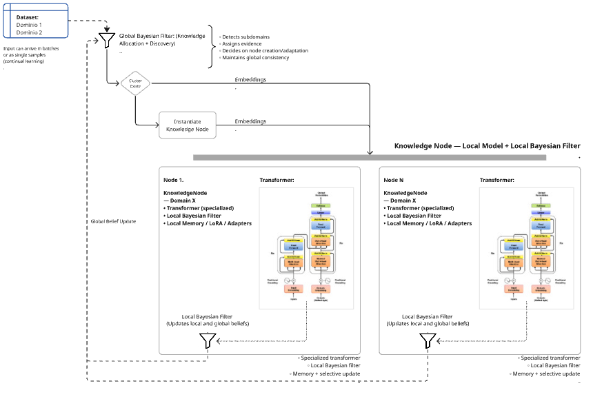

# Xctopus

<div align="center">


[](https://xctopus.com)
[](#-links-and-resources)

</div>

**Xctopus** is an experimental framework for Distributed Epistemic Memory, designed as a hierarchical continual-learning system built from Transformers, Bayesian Nodes, and modular knowledge orchestration. It explores how adaptive, progressive, and traceable learning can emerge from interacting knowledge units, enabling research into flexible architectures that evolve over time. Contributions are welcome as the system continues to grow.

### Technology Stack

<div align="left">


</div>

### Table of Contents

- [Project Objective](#project-objective)
- [Conceptual Architecture](#conceptual-architecture)
- [Project Structure](#project-structure)
- [Installation](#installation)
- [Links and Resources](#links-and-resources)
- [Usage Examples](#usage-examples)
- [Roadmap](#roadmap)
- [Contributions](#contributions)
- [License](#license)
- [More Information](#more-information)

---

### Project Objective

Develop an architecture where multiple Knowledge Nodes collaborate to process information, update Bayesian beliefs, and enable cumulative learning while preserving previously acquired knowledge.
The goal is to explore how modular, hierarchical, and epistemically-grounded components can support flexible, scalable, and traceable continuous learning.

Xctopus is, for now, an evolving research prototype.

### Project Status

⚠️ **Alpha / Experimental** — Xctopus is currently an evolving research prototype. The framework is experimental, under active development, and APIs may change. Use with caution in production environments. Contributions and feedback are welcome as the system continues to grow.

---

### Conceptual Architecture



Xctopus architecture is based on three principles:

### **1. Hierarchical Nodes**

Each Knowledge Node encapsulates a self-contained computational unit composed of:

* An internal Transformer model
* A Bayesian update/filtering mechanism
* A feedback loop for internal state refinement
* Inheritable hyperparameters passed from upper-level controllers

This structure enables progressive specialization while maintaining architectural coherence across the hierarchy.

### **2. Modular Orchestration**


Nodes interact through a lightweight orchestration layer capable of:

* Sharing signals and intermediate representations
* Assigning domain-specific processing roles
* Routing outputs toward upper filters for integration and global reasoning
* The orchestration design promotes scalability and domain-modular learning.


### **3. Continuous Learning**

Xctopus incorporates principles from *Bayesian Continual Learning* to support:

* Belief updating over time
* Dynamic prior adjustment
* Preservation and evolution of internal state histories
* Structured logging for traceability and interpretability

---

### Project Structure

```
xctopus/
├── assets/                 # Visual resources (diagrams, images)
├── scripts/                # Scripts and utilities
│   ├── cli/                # CLI tools
│   │   └── xctopus_run.py  # Main CLI entry point
│   └── deprecated/         # Legacy scripts (deprecated, not in repo)
│       └── (legacy numbered scripts 00-99 and download utilities) 
├── datasets/               # Test datasets / examples
├── notebooks/              # Demonstration notebooks
│   ├── xctopus_training_evaluation.ipynb  # ⭐ Interactive notebook (Training + Evaluation)
│   └── demo_bayesian.ipynb                # Basic demo
├── src/
│   ├── __init__.py
│   └── xctopus/
│       ├── __init__.py     # Public API: exposes main nodes
│       ├── main.py         # CLI / entry point
│       ├── core/
│       │   ├── __init__.py
│       │   └── config/
│       │       └── config.yaml
│       ├── modules/        # Internal components / pipelines
│       └── nodes/
│           ├── base_node.py # Optional: base class for all nodes
│           ├── bayesian/
│           │   ├── __init__.py
│           │   ├── bayesian_node.py
│           │   ├── bayesian_filter.py
│           │   ├── core/                     # Core components (required)
│           │   │   ├── __init__.py
│           │   │   └── text_preprocessor.py  # TextPreprocessor (core)
│           │   └── utils/                   # Utilities (optional)
│           │       ├── __init__.py
│           │       ├── cluster_analyzer.py   # ClusterAnalyzer (utility)
│           │       ├── clustering_config.py # DynamicClusteringConfig (config)
│           │       ├── cluster_utils.py    # Unified cluster utility functions
│           │       ├── learning_auditor.py # LearningAuditor (audit utilities)
│           │       ├── lora_auditor.py     # LoRAAuditor (LoRA auditing)
│           │       └── learning_evaluator.py # LearningEvaluator (advanced evaluation)
│           └── transformer/
│               ├── __init__.py
│               └── transformer.py
├── tests/                  # Unit tests
├── .gitignore
├── config.yaml             # Global configuration / example
├── pyproject.toml          # Dependencies + CLI scripts
└── README.md               # Documentation and user guide
```

---

### Installation


```bash
pip install -r requirements.txt
```

### Quick Start

### Using XctopusPipeline (Recommended)

The easiest way to use Xctopus is through the `XctopusPipeline` API:

```python
from xctopus import XctopusPipeline

# Create pipeline with your dataset
pipeline = XctopusPipeline('data/dataset.csv')

# Run full pipeline
results = pipeline.run()

# Or run specific steps
pipeline.run(step='clustering', epochs=10)
pipeline.run(step='fine_tune')
```

### Using CLI

You can also use the command-line interface:

```bash
# Run full pipeline
xctopus-run data/dataset.csv

# Run specific step
xctopus-run data/dataset.csv --step clustering --epochs 10

# With custom configuration
xctopus-run data/dataset.csv --config config.yaml

# Load checkpoint and continue
xctopus-run data/dataset.csv --load-checkpoint checkpoint.ckpt --step fine_tune
```

### Using Jupyter Notebook (Interactive)

For an interactive experience with parameter tuning and visualizations:

```bash
# Open Jupyter Notebook
jupyter notebook notebooks/xctopus_training_evaluation.ipynb
```

The `xctopus_training_evaluation.ipynb` notebook allows you to:
- <svg xmlns="http://www.w3.org/2000/svg" class="icon icon-circle-check" width="16" height="16" viewBox="0 0 24 24" stroke-width="2" stroke="currentColor" fill="none" stroke-linecap="round" stroke-linejoin="round" style="vertical-align: middle;"><path stroke="none" d="M0 0h24v24H0z" fill="none"/><path d="M12 12m-9 0a9 9 0 1 0 18 0a9 9 0 1 0 -18 0" /><path d="M9 12l2 2l4 -4" /></svg> **Adjust parameters** easily (thresholds, epochs, etc.)
- <svg xmlns="http://www.w3.org/2000/svg" class="icon icon-circle-check" width="16" height="16" viewBox="0 0 24 24" stroke-width="2" stroke="currentColor" fill="none" stroke-linecap="round" stroke-linejoin="round" style="vertical-align: middle;"><path stroke="none" d="M0 0h24v24H0z" fill="none"/><path d="M12 12m-9 0a9 9 0 1 0 18 0a9 9 0 1 0 -18 0" /><path d="M9 12l2 2l4 -4" /></svg> **Change dataset** with a simple variable change
- <svg xmlns="http://www.w3.org/2000/svg" class="icon icon-circle-check" width="16" height="16" viewBox="0 0 24 24" stroke-width="2" stroke="currentColor" fill="none" stroke-linecap="round" stroke-linejoin="round" style="vertical-align: middle;"><path stroke="none" d="M0 0h24v24H0z" fill="none"/><path d="M12 12m-9 0a9 9 0 1 0 18 0a9 9 0 1 0 -18 0" /><path d="M9 12l2 2l4 -4" /></svg> **Run Training and Evaluation** step by step
- <svg xmlns="http://www.w3.org/2000/svg" class="icon icon-circle-check" width="16" height="16" viewBox="0 0 24 24" stroke-width="2" stroke="currentColor" fill="none" stroke-linecap="round" stroke-linejoin="round" style="vertical-align: middle;"><path stroke="none" d="M0 0h24v24H0z" fill="none"/><path d="M12 12m-9 0a9 9 0 1 0 18 0a9 9 0 1 0 -18 0" /><path d="M9 12l2 2l4 -4" /></svg> **View visualizations** directly in the notebook
- <svg xmlns="http://www.w3.org/2000/svg" class="icon icon-circle-check" width="16" height="16" viewBox="0 0 24 24" stroke-width="2" stroke="currentColor" fill="none" stroke-linecap="round" stroke-linejoin="round" style="vertical-align: middle;"><path stroke="none" d="M0 0h24v24H0z" fill="none"/><path d="M12 12m-9 0a9 9 0 1 0 18 0a9 9 0 1 0 -18 0" /><path d="M9 12l2 2l4 -4" /></svg> **Experiment** with different configurations

### Advanced Usage

```python
from xctopus import XctopusPipeline, PipelineConfig

# Create pipeline with custom configuration
config = PipelineConfig.from_yaml('config.yaml')
pipeline = XctopusPipeline('data.csv', config=config)

# Run with custom parameters
pipeline.run(step='clustering', epochs=5, enable_training=True)

# Access results
nodes = pipeline.get_nodes()
results = pipeline.get_results()

# Save checkpoint
pipeline.save_state('checkpoint.ckpt')

# Export pipeline graph
pipeline.export_graph_mermaid('pipeline_graph.mmd')
```

---

### Legacy API (Backward Compatibility)

The following imports are still available for backward compatibility:

```python
from xctopus.nodes.bayesian import BayesianNode
from xctopus.nodes.transformer import TransformerNode

# Core components (required for pipeline)
from xctopus.nodes.bayesian.core import TextPreprocessor

# Utilities (optional, for analysis and configuration)
from xctopus.nodes.bayesian.utils import (
    ClusterAnalyzer, 
    ClusterAnalysisConfig,
    DynamicClusteringConfig,
    LearningAuditor,
    LoRAAuditor,              # LoRA parameter auditing
    LearningEvaluator,        # Advanced learning evaluation
    # Cluster utility functions
    identify_large_clusters,
    fine_tune_cluster_with_lora,
    analyze_cluster_distribution,
    find_similar_cluster_pairs,
    determine_node_configuration,
    evaluate_cluster_quality,  # Cluster quality metrics
    extract_embeddings_from_nodes
)
```

---

### Links and Resources

<div align="left">

[](https://xctopus.com)
[](#-links-and-resources)
[](./notebooks)

</div>

- 🌐 **Official website**: [xctopus.com](https://xctopus.com)
- 📚 **Documentation**: See `docs/` folder for detailed guides
- 📊 **Demonstration notebooks**: See `notebooks/` folder
  - `xctopus_training_evaluation.ipynb` - Interactive notebook for training and evaluation with parameter tuning
- 💬 **Research Discussion**: [Approaches to Mitigate Catastrophic Forgetting in Modular Systems](https://discuss.huggingface.co/t/approaches-to-mitigate-catastrophic-forgetting-in-modular-systems/170536) - Hugging Face discussion on modular learning architectures

---

### Usage Examples

### XctopusPipeline - Complete Workflow

```python
from xctopus import XctopusPipeline

# Initialize pipeline
pipeline = XctopusPipeline(
    dataset_path='data/dataset.csv',
    text_columns=['title', 'abstract'],  # Auto-detected if not specified
    model_name='sentence-transformers/all-MiniLM-L6-v2'
)

# Run full pipeline
results = pipeline.run_full_pipeline()

# Or run steps individually
pipeline.run(step='analysis')
pipeline.run(step='clustering', epochs=10)
pipeline.run(step='config_update')
pipeline.run(step='fine_tune')
pipeline.run(step='optimize')
pipeline.run(step='audit')
pipeline.run(step='evaluation')

# Access results
nodes = pipeline.get_nodes()
results = pipeline.get_results()
config = pipeline.get_config()

# Save and load state
pipeline.save_state('checkpoint.ckpt')
pipeline.load_state('checkpoint.ckpt')

# Visualize pipeline
graph = pipeline.get_graph()
pipeline.export_graph_mermaid('pipeline_graph.mmd')
```

### Configuration with YAML

```python
from xctopus import XctopusPipeline, PipelineConfig

# Load configuration from YAML
pipeline = XctopusPipeline('data.csv', config='config.yaml')

# Or create config programmatically
config = PipelineConfig(
    EMBEDDING_MODEL='sentence-transformers/all-MiniLM-L6-v2',
    MIN_CLUSTER_SIZE=5,
    NUM_EPOCHS=7,
    USE_LORA=True,
    LORA_R=8
)
pipeline = XctopusPipeline('data.csv', config=config)
```

### Custom Steps (Plugin System)

```python
from xctopus import XctopusPipeline
from xctopus.pipeline.steps import register_step
from xctopus.pipeline.steps.base import PipelineStep

# Define custom step
class MyCustomStep(PipelineStep):
    def execute(self, pipeline, **kwargs):
        # Your custom logic
        return {"result": "custom"}
    
    def validate_inputs(self, pipeline, **kwargs):
        pass

# Register and use
register_step("my_custom", MyCustomStep)
pipeline = XctopusPipeline('data.csv')
pipeline.run(step='my_custom')
```

<details>
<summary><strong>Legacy API Examples</strong> - Basic node usage, text preprocessing, cluster analysis, and fine-tuning</summary>

#### Basic Node Usage

```python
from xctopus.nodes.bayesian import BayesianNode
node = BayesianNode()
output = node.process(input_data)
```

### Text Preprocessing

```python
from xctopus.nodes.bayesian.core import TextPreprocessor

# Initialize preprocessor
preprocessor = TextPreprocessor(
    path_dataset="data/dataset.csv",
    text_columns=["title", "abstract"],
    join_with="\n",
    model_name="all-MiniLM-L6-v2"
)

# Process dataset and get embeddings
embeddings = preprocessor.process_dataset()
```

### Cluster Analysis

```python
from xctopus.nodes.bayesian.utils import ClusterAnalyzer, ClusterAnalysisConfig

# Configure analysis
config = ClusterAnalysisConfig(
    save_plots=True,
    compute_advanced_metrics=True,
    plot_format='png',
    enable_adaptive_merge=True  # Enable adaptive cluster merging
)

# Initialize analyzer
analyzer = ClusterAnalyzer(config=config)

# Run full analysis pipeline
summary = analyzer.run_full_analysis(
    dataset_path="data/dataset.csv",
    text_preprocessor=preprocessor
)

# Or use programmatically
analyzer.load_dataset(dataframe=df)
analyzer.encode_texts()
analyzer.assign_clusters()
statistics = analyzer.compute_statistics()
orphans_result = analyzer.identify_orphan_clusters()  # Returns dict with 'orphans' and 'outliers'
problems = analyzer.detect_problems()
recommendations = analyzer.generate_recommendations()

# Optional: merge clusters adaptively
merge_stats = analyzer.merge_clusters_adaptively(
    max_iterations=10,
    semantic_threshold=0.85
)

# Advanced metrics (includes Davies-Bouldin and outlier detection)
metrics = analyzer.compute_advanced_metrics()
print(f"Silhouette: {metrics['silhouette_score']}")
print(f"Davies-Bouldin: {metrics['davies_bouldin_score']}")
print(f"Outliers: {metrics['n_outliers']}")
```

### Dynamic Clustering Pipeline Configuration

```python
from xctopus.nodes.bayesian.utils import DynamicClusteringConfig

# Use default configuration
config = DynamicClusteringConfig()

# Or customize parameters
config = DynamicClusteringConfig(
    EMBEDDING_MODEL='sentence-transformers/all-MiniLM-L6-v2',
    MIN_CLUSTER_SIZE=5,
    NUM_EPOCHS=7,
    USE_LORA=True,
    LORA_R=8
)

# Update configuration after creation
config.update(MIN_CLUSTER_SIZE=10, NUM_EPOCHS=10)

# Export to dictionary
config_dict = config.to_dict()
```

### Fine-Tuning Large Clusters

```python
from xctopus.nodes.bayesian.utils import identify_large_clusters, fine_tune_cluster_with_lora

# Identify large clusters
large_clusters = identify_large_clusters(
    nodes_dict=knowledge_nodes_dict,
    min_size=50
)

# Fine-tune a specific cluster
for cluster_id, cluster_size, node in large_clusters:
    embeddings = node.filter.memory.get(cluster_id, [])
    results = fine_tune_cluster_with_lora(
        node=node,
        embeddings=embeddings,
        num_epochs=5,
        learning_rate=0.001
    )
    print(f"Cluster {cluster_id}: Improvement = {results['improvement']:.6f}")
```

</details>

### Command Line Interface (CLI)

The recommended way to run Xctopus from the command line:

```bash
# Run full pipeline
xctopus-run data/dataset.csv

# Run specific step
xctopus-run data/dataset.csv --step clustering --epochs 10

# With configuration file
xctopus-run data/dataset.csv --config config.yaml

# Skip optional steps
xctopus-run data/dataset.csv --skip-analysis --skip-evaluation

# Load checkpoint and continue
xctopus-run data/dataset.csv --load-checkpoint checkpoint.ckpt --step fine_tune

# Export pipeline graph
xctopus-run data/dataset.csv --export-graph pipeline_graph.mmd

# Save checkpoint after execution
xctopus-run data/dataset.csv --save-checkpoint checkpoint.ckpt

# Specify text columns manually
xctopus-run data/dataset.csv --text-columns title abstract

# Disable auto-detection
xctopus-run data/dataset.csv --no-auto-detect --text-columns title

# Verbose output
xctopus-run data/dataset.csv --verbose
```

<details>
<summary><strong>Cluster Utility Functions</strong> - Advanced cluster analysis, merging, and quality evaluation</summary>

```python
from xctopus.nodes.bayesian.utils import (
    identify_large_clusters,
    fine_tune_cluster_with_lora,
    analyze_cluster_distribution,
    find_similar_cluster_pairs,
    determine_node_configuration
)

# Identify large clusters
large_clusters = identify_large_clusters(nodes_dict, min_size=50)

# Analyze cluster distribution
distribution = analyze_cluster_distribution(
    cluster_sizes={0: 10, 1: 50, 2: 100},
    orphan_threshold=3,
    small_threshold=5,
    medium_threshold=20
)

# Find similar cluster pairs for merging
similar_pairs = find_similar_cluster_pairs(
    centroids=centroids_dict,
    similarity_threshold=0.7,
    max_pairs=10
)

# Determine optimal node configuration
layers, rank = determine_node_configuration(cluster_size=50)

# Evaluate cluster quality
from xctopus.nodes.bayesian.utils import evaluate_cluster_quality, extract_embeddings_from_nodes

embeddings, labels, _ = extract_embeddings_from_nodes(knowledge_nodes_dict)
metrics = evaluate_cluster_quality(embeddings, labels)
print(f"Silhouette: {metrics['silhouette_score']}")
print(f"Davies-Bouldin: {metrics['davies_bouldin_score']}")
```

</details>

<details>
<summary><strong>LoRA Auditing and Advanced Evaluation</strong> - Monitor LoRA parameter changes and evaluate learning performance</summary>

```python
from xctopus.nodes.bayesian.utils import LoRAAuditor, LearningEvaluator
import torch

# Initialize LoRA auditor
lora_auditor = LoRAAuditor(device=torch.device("cpu"), verbose=True)

# Capture LoRA state before training
initial_state = lora_auditor.capture_state(knowledge_node)

# ... perform training ...

# Capture LoRA state after training
final_state = lora_auditor.capture_state(knowledge_node)

# Compute changes in LoRA parameters
changes = lora_auditor.compute_changes(initial_state, final_state)
print(f"LoRA parameters changed: {changes['changed_params']:,}")
print(f"Mean absolute change: {changes['mean_absolute_change']:.8f}")

# Visualize LoRA parameter changes
lora_auditor.visualize_changes(changes, output_path="lora_changes.png")

# Advanced learning evaluation
evaluator = LearningEvaluator(device=torch.device("cpu"), d_model=128)

# Evaluate node performance with multiple embeddings
metrics = evaluator.evaluate_node_performance(
    node=knowledge_node,
    embeddings_list=test_embeddings,
    node_id="Cluster_0"
)
print(f"Average similarity: {metrics['avg_similarity']:.4f}")

# Compare before/after training
comparison = evaluator.compare_before_after_training(
    pipeline_result=pipeline_result,
    test_texts=test_texts,
    train_epochs=5
)

# Generate comprehensive learning report
report = evaluator.generate_learning_report(
    pipeline_result=pipeline_result,
    test_texts=test_texts,
    train_epochs=5
)
```

</details>

---

### Roadmap

### Phase 1 — System Core (in progress)

* <svg xmlns="http://www.w3.org/2000/svg" class="icon icon-circle-check" width="16" height="16" viewBox="0 0 24 24" stroke-width="2" stroke="currentColor" fill="none" stroke-linecap="round" stroke-linejoin="round" style="vertical-align: middle;"><path stroke="none" d="M0 0h24v24H0z" fill="none"/><path d="M12 12m-9 0a9 9 0 1 0 18 0a9 9 0 1 0 -18 0" /><path d="M9 12l2 2l4 -4" /></svg> Conceptual design
* <svg xmlns="http://www.w3.org/2000/svg" class="icon icon-circle-check" width="16" height="16" viewBox="0 0 24 24" stroke-width="2" stroke="currentColor" fill="none" stroke-linecap="round" stroke-linejoin="round" style="vertical-align: middle;"><path stroke="none" d="M0 0h24v24H0z" fill="none"/><path d="M12 12m-9 0a9 9 0 1 0 18 0a9 9 0 1 0 -18 0" /><path d="M9 12l2 2l4 -4" /></svg> Initial Bayesian node prototypes
* <svg xmlns="http://www.w3.org/2000/svg" class="icon icon-circle-check" width="16" height="16" viewBox="0 0 24 24" stroke-width="2" stroke="currentColor" fill="none" stroke-linecap="round" stroke-linejoin="round" style="vertical-align: middle;"><path stroke="none" d="M0 0h24v24H0z" fill="none"/><path d="M12 12m-9 0a9 9 0 1 0 18 0a9 9 0 1 0 -18 0" /><path d="M9 12l2 2l4 -4" /></svg> Integration with internal transformer

### Phase 2 — Functional Prototype

* [ ] Internal API between nodes
* [ ] Structured logging
* [ ] Examples and use cases

### Phase 3 — Community

* [ ] Repository publication
* [ ] Enable GitHub discussions
* [ ] Comprehensive documentation

### Phase 4 — Advanced Continuous Learning

* [ ] Complete Bayesian CL integration
* [ ] Benchmark experiments

---

### Contributions

Contributions are welcome! We appreciate your interest in helping improve Xctopus.

- 📖 **Read our [Contributing Guide](CONTRIBUTING.md)** to get started
- 📋 **Review our [Code of Conduct](CODE_OF_CONDUCT.md)** to understand our community standards 

Whether you're fixing bugs, adding features, improving documentation, or suggesting ideas, all contributions are valued and recognized.

---

### License

This project is licensed under the MIT License - see the [LICENSE.md](LICENSE.md) file for details.

---

### More Information

For more information, updated documentation, and additional resources, visit [xctopus.com](https://xctopus.com)

---

### Final Note

This project is in an exploratory phase. The intention is to build an innovative architecture, inspired by adaptive and hierarchical systems, and open it to interested researchers when ready.

 